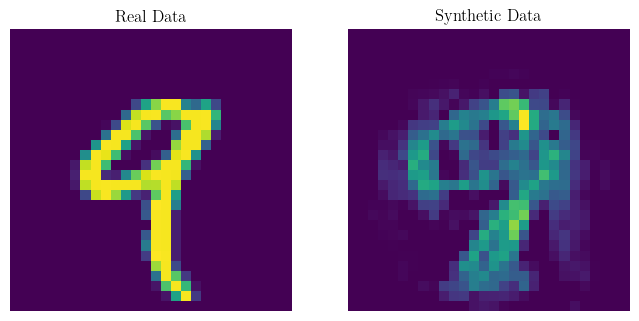
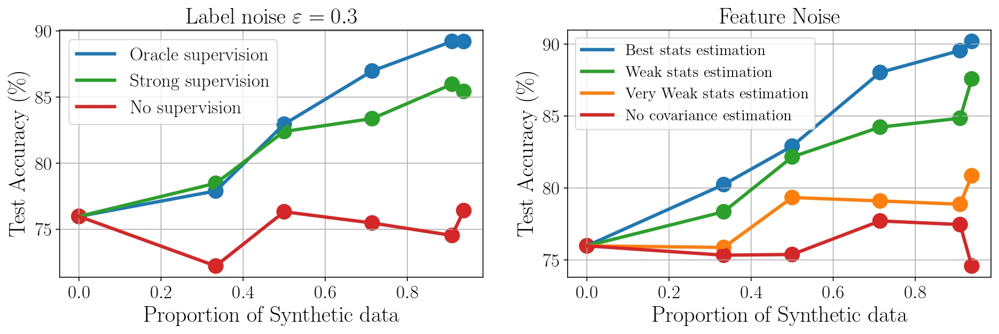
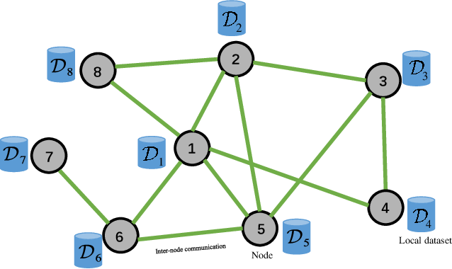
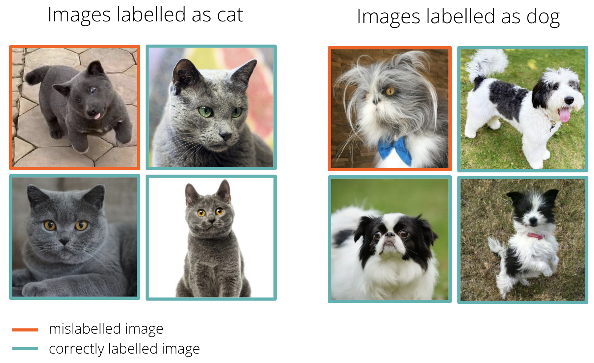

## On the impact of Synthetic data on Model's performance
----

The landscape of large language models (LLMs) is evolving rapidly, with a growing trend towards
training models on a combination of real and synthetic data. This synthetic data is often generated by previously trained models. However, the quality of these generators can significantly impact the performance of newly trained models, potentially leading to **model collapse** [(Shumailov et al., 2023)](https://arxiv.org/pdf/2305.17493), a phenomenon in which the model
drastically degrades in performance. 
While current theoretical studies primarily focus on label noise in synthetic data, they often overlook potential distribution shifts in the feature space between real and synthetic data. This gap is particularly relevant in practical scenarios where generative models are trained on finite real data sets, potentially leading to imperfect learning of the underlying distribution.
At the [Technology Innovation Institute](https://www.tii.ae/), together with **Dr. Mohamed El Amine Seddik**, we address this gap by proposing a statistical model that accounts for both distribution shifts in the feature space and label noise. In our model, we induce distribution shifts in the feature space by supposing that the statistics of synthetic data are empirical estimates of the underlying real data statistics. Our theoretical results are derived using **Random Matrix Theory.**

### Resources:
- 📄 [Paper](../files/ICLR_2025_Final_paper.pdf)
- 💻 [Code Repository](https://github.com/elfirdoussilab1/Synthetic-data)

## Privacy preserving Decentralized Learning
----

In numerous machine learning scenarios, the training dataset is dispersed among diverse sources, including individual users or distinct organizations responsible for generating each data segment. The nature of such data often involves privacy concerns, especially in applications like healthcare, which can divulge sensitive information about an individual’s health. Privacy issues make it either impractical or undesirable to transfer the data beyond their original sources, promoting the emergence of **federated** and **decentralized** learning, where the training occurs directly on the data-holding entities. Decentralized learning additionally removes the assumption of a **central server**, with only the model updates being transmitted directly between users.

Decentralized learning is appealing as it enables the scalable usage of large amounts of distributed data and resources (without resorting to any central entity), while promoting privacy since every user minimizes the direct exposure of their data. Yet, without additional precautions, curious users can still leverage models obtained from their peers to violate privacy. In this paper, we propose **DECOR**, a variant of decentralized SGD with **differential privacy** (DP) guarantees. In DECOR, users securely exchange randomness seeds in one communication round to generate pairwise-canceling correlated Gaussian noises, which are injected to protect local models at every communication round. We theoretically and empirically show that, for arbitrary connected graphs, DECOR matches the central DP optimal privacy-utility trade-off.

### Resources:
- 📄 [Paper](https://arxiv.org/pdf/2405.01031)
- 💻 [Code Repository](https://github.com/elfirdoussilab1/DECOR)

## High-dimensional Learning with Noisy Labels
----

Machine learning algorithms are usually built upon low-dimensional intuitions which do not necessarily hold when processing high-dimensional data. Numerous studies have demonstrated the effects of the curse of dimensionality, by showing that high dimensions can alter the internal functioning of various ML methods designed with low-dimensional intuitions.
This project provides theoretical insights into high-dimensional binary classification with class-conditional noisy labels. Specifically, relying on **Random Matrix Theory**, we study the behavior of a linear classifier with a label noisiness aware loss function, when both the dimension of data p and the sample size n are large and comparable. Importantly, our findings show that the low-dimensional intuitions to handle label noise **do not hold** in high-dimension, in the sense that the optimal classifier in low-dimension dramatically fails in high-dimension. Based on our derivations, we design an optimized method that is shown to be provably more efficient in handling noisy labels in high dimensions.

### Resources:
- 📄 [Paper](../files/High_dimensional_Learning_with_Noisy_Labels.pdf)
- 💻 [Code Repository](https://github.com/elfirdoussilab1/High-Dimensional-Learning-Noisy-Labels)

## Composed Image Retrieval
----

Composed Image Retrieval (CoIR) has recently gained much attention by the computer vision community. It involves retrieving images based on a complex multi-type query comprised of a reference image and a text modification of this latter. CoIR is inherently challenging as it requires using advanced techniques to learn and integrate both visual and textual information. Many models have been created to solve this task, among which we find [BLIP](https://arxiv.org/pdf/2201.12086) and [BLIP-2](https://arxiv.org/pdf/2301.12597) models.

In this project, I investigated on the impact of the different embeddings produced by the BLIP model, which are the *query embedding* **q**, the *modification text* **t** and the *multimodal embedding* **f(q, t)**.

### Resources:
- 📄 [Presentation](../files/RecVis_MVA_Presentation.pdf)
- 📄 [Project report](../files/recvis_report.pdf)
- 💻 [Code Repository](https://github.com/elfirdoussilab1/RecVis-project)

## Stein Variational Gradient Descent
----

Worked under the supervision of Prof. **Pascal Bianchi** in the [LTCI](https://www.telecom-paris.fr/fr/recherche/labos/traitement-information-ltci) lab at Télécom Paris on developing the theoretical part of the **Stein Variational Gradient Descent (SVGD)**, a recently discovered algorithm (since 2016) used for sampling from a wide variety of probability distributions. Unlike traditional methods, SVGD does not require restrictive conditions on the distribution to sample from.

This algorithm can be used in a wide variety of Machine Learning tasks such as **Reinforcement learning** and **Bayesian Machine Learning**. Additionally, sampling from a distribution is crucial in simulations across multiple domains:
- **Biology**: Simulating disease propagation in a population.
- **Finance**: Applying Monte Carlo methods for integral approximations.

In this project, I studied the convergence properties of SVGD, as well as porposed novel algorithms that enhance its performance. For instance, I proposed a **stochastic** version of SVGD (which I called **Stochastic SVGD**), as well as a mixture of SVGD and the well-known **Langevin** algorithm. My work is summarized in the two following reports: **state-of-the-art** and **final report.** 
### Resources:
- 📄 [State of the Art](../files/SVGD_State_of_the_Art.pdf)
- 📄 [Final Article](../files/SVGD_Final_report.pdf) *(Proposal of new algorithms improving SVGD)*
- 💻 [Code Repository](https://github.com/elfirdoussilab1/SVGD)

----