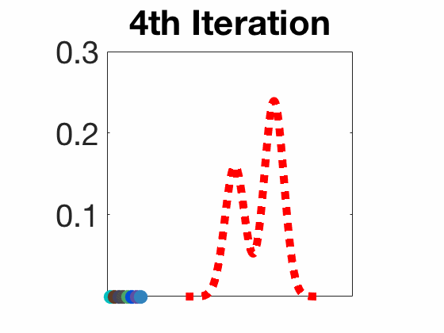
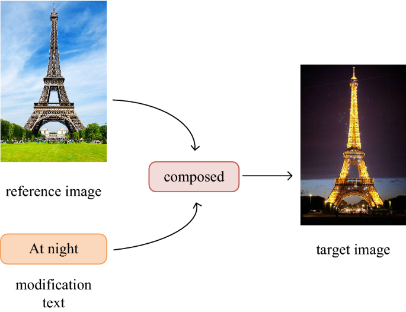
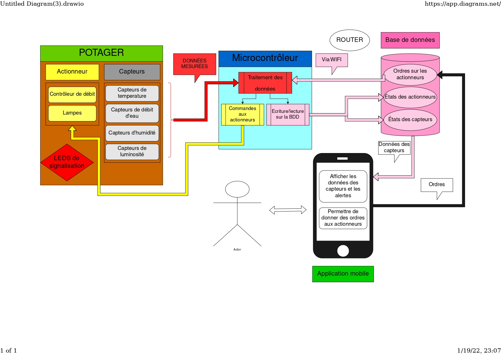
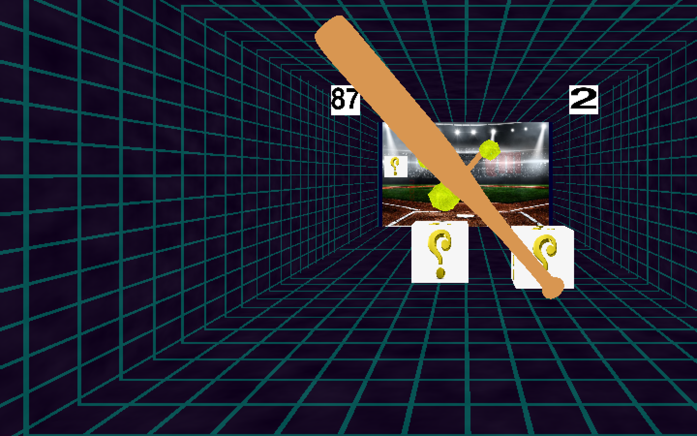

## Stein Variational Gradient Descent
---

Worked under the supervision of Prof. **Pascal Bianchi** in the [LTCI](https://www.telecom-paris.fr/fr/recherche/labos/traitement-information-ltci) lab at Télécom Paris on developing the theoretical part of the **Stein Variational Gradient Descent (SVGD)**, a recently discovered algorithm (since 2016) used for sampling from a wide variety of probability distributions. Unlike traditional methods, SVGD does not require restrictive conditions on the distribution to sample from.

This algorithm can be used in a wide variety of Machine Learning tasks such as **Reinforcement learning** and **Bayesian Machine Learning**. Additionally, sampling from a distribution is crucial in simulations across multiple domains:
- **Biology**: Simulating disease propagation in a population.
- **Finance**: Applying Monte Carlo methods for integral approximations.

SVGD employs a "kernelized" version of the **Wasserstein Gradient Descent** algorithm. More information about this can be found in my **state-of-the-art review** and **project report**.

### Resources:
- 📄 [State of the Art](../files/SVGD_State_of_the_Art.pdf)
- 📄 [Final Article](../files/SVGD_Final_report.pdf) *(Proposal of new algorithms improving SVGD)*
- 💻 [Code Repository](https://github.com/elfirdoussilab1/SVGD)

## Composed Image Retrieval
---

Composed Image Retrieval (CoIR) has recently gained much attention by the computer vision community. It involves retrieving images based on a complex multi-type query comprised of a reference image and a text modification of this latter. CoIR is inherently challenging as it requires using advanced techniques to learn and integrate both visual and textual information. Many models have been created to solve this task, among which we find [BLIP](https://arxiv.org/pdf/2201.12086) and [BLIP-2](https://arxiv.org/pdf/2301.12597) models.

In this project, I investigated on the impact of the different embeddings produced by the BLIP model, which are the *query embedding* **q**, the *modification text* **t** and the *multimodal embedding* **f(q, t)**.

### Resources:
- 📄 [Presentation](../files/RecVis_MVA_Presentation.pdf)
- 📄 [Project report]() *(coming soon)*
- 💻 [Code Repository]()*(coming soon)*

----

# Software engineering projects:

## Garden Connection Kit: Pact'AG
---

During our first year at Télécom Paris, we created as a team of 6 members, a kit to connect a garden.

If you want to start growing your own fruits and vegetables, or any plant that you want, then you can use our product (this is just the purpose of the project, but we are not selling it actually !). 

The kit is comprised of a box that contains micro-controller that controls the actuators like lamps and pumps, and get the values of the different sensors like temperature, humidity and luminosity.

To manipulate the garden, like activating the pumps or just getting the temperature of the garden, we developed an android application that communicates with the micro-controller using a server. This server modifies a database and send the client’s orders to the micro-controller to execute them. 

### Resources:
- 📄 [Poster](../files/pactag_poster.pdf)
- 💻 [Code Repository](https://github.com/elfirdoussilab1/PACTAG)

## Stereogame
-

As a team of 4, we created a game using OpenGL and the Python library pygame, which we called stereogame.

It is a two players game that looks like tennis but where you use a bat instead of a racket. And there are some special effects like explosive balls, or cloning the ball into 3, or teleportation, etc.

And what makes this game special is that it is suited for a 3D TV, and both players look at the same TV but from different angles, and when you change the angle you can see the camera of the other player. So using this technique, we can add as many players as we want in the game, and they will all see their own camera in full screen using on single TV. Hence, we don’t need to split our screen to sub-screens !

### Resources:
- 💻 [Code Repository](https://github.com/elfirdoussilab1/PACTAG)
